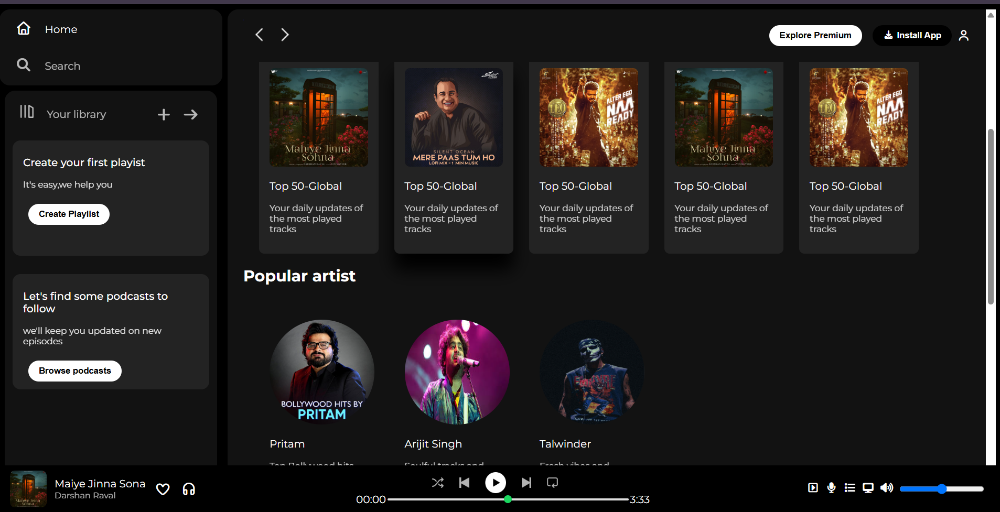

# spotify-web-player-clone
🎵 A responsive Spotify Web Player UI clone built using HTML5 and CSS3.

A responsive Spotify Web Player UI Clone built using HTML and CSS. This project recreates the look and feel of Spotify's desktop interface, including a sidebar, music player controls, trending songs, featured charts, and popular artists section.

---

## 🌐 Live Demo

👉  https://agarwalmanish3922-code.github.io/spotify-web-player-clone/


---

## 📸 Preview



---

## ✨ Features

- 🎵 Spotify-inspired user interface
- 📱 Responsive design
- 🎧 Music player section
- 🔍 Sidebar navigation
- 📈 Trending songs section
- ⭐ Featured charts section
- 🎤 Popular artists section
- 🎨 Modern UI using Flexbox

---

## 🛠️ Tech Stack

- HTML5
- CSS3
- Font Awesome
- Google Fonts (Montserrat)

---

## 📚 What I Learned

Through this project, I learned:

- Building complex layouts using Flexbox
- Creating responsive web pages
- Organizing frontend projects
- Using Font Awesome icons
- Working with images and assets
- Improving UI/UX design skills

---

## 📂 Project Structure

```text
Spotify-Clone/
│
├── index.html
├── style.css
└── assets/
    ├── card1img.jpeg
    ├── card2img.jpeg
    ├── ...
    └── preview.png
```

---

## 🚀 Getting Started

### Clone the Repository

```bash
git clone https://github.com/agarwalmanish3922-code/Spotify-Clone.git
```

### Open the Project

Simply open:

```text
index.html
```

in your browser.

---

## 💡 Future Improvements

- Add JavaScript functionality
- Implement music playback
- Add search functionality
- Create playlists dynamically
- Connect with Spotify API

---

## 👨‍💻 Author

**Manish Agarwal**

GitHub: https://github.com/agarwalmanish3922-code

---

## ⭐ Support

If you like this project, consider giving it a ⭐ on GitHub!

---

### 🎯 Project Status

✅ Completed  
🔄 Open for improvements